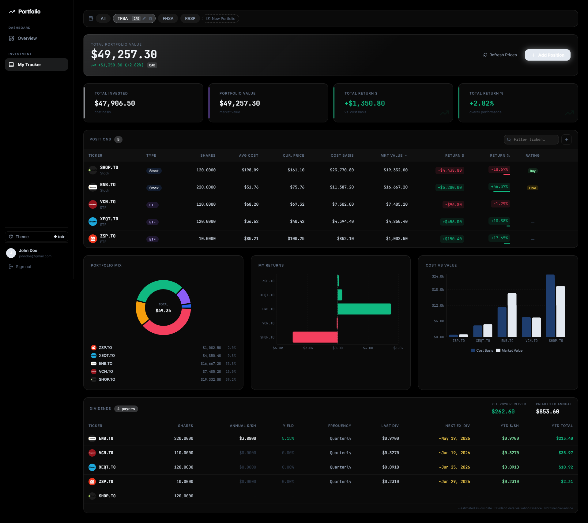

# 📈 Portfolio Tracker

[](LICENSE)
[](https://nodejs.org)
[](https://react.dev)
[](https://www.mongodb.com)
[](server/tests)

A full-stack personal investment portfolio tracker with live market prices, multi-currency support, dividend tracking, analyst ratings, and named portfolio accounts (TFSA, FHSA, RRSP, etc.).



---

## ✨ Features

- **Live prices** — auto-fetched from Yahoo Finance on every load and refresh
- **Named portfolios** — create TFSA, FHSA, RRSP, or any custom account name
- **Multi-currency** — per-portfolio currency selection (CAD, USD, EUR, GBP, JPY, AUD, CHF, INR, HKD) with real-time FX conversion on the All tab
- **Dividends** — upcoming ex-dividend dates, annual rate/yield, YTD income, and projected annual income per position
- **Analyst ratings** — consensus rating (Strong Buy → Strong Sell) with score and analyst count via Yahoo Finance
- **Charts** — Portfolio Mix (donut), Returns (bar), Cost vs Value (grouped bar)
- **Themes** — 6 built-in themes: Midnight Blue, Obsidian, Aurora, Forest, Sunset, Noir
- **Google OAuth** — sign in with Google or email/password

---

## 🗂️ Repository Structure

```
portfolio-tracker/
├── client/                  # React + Vite + TypeScript frontend
│   ├── src/
│   │   ├── api/             # API client (typed fetch wrappers)
│   │   ├── components/
│   │   │   ├── Layout/      # Sidebar, Layout shell
│   │   │   └── Portfolio/   # ManualTracker (main dashboard)
│   │   ├── contexts/        # AuthContext, ThemeContext
│   │   └── pages/           # SignIn, SignUp
│   └── README.md
├── server/                  # Express + MongoDB backend
│   ├── middleware/          # JWT auth middleware
│   ├── models/              # Mongoose schemas (User, Portfolio, Position)
│   ├── routes/              # REST API routes
│   ├── services/            # Yahoo Finance, dividends, ratings, price services
│   └── README.md
├── .gitignore
├── LICENSE
└── README.md
```

---

## 🚀 Quick Start

### Prerequisites

| Tool | Version |
|------|---------|
| Node.js | 18+ |
| npm | 9+ |
| MongoDB | Atlas (free tier works) |

### 1. Clone

```bash
git clone https://github.com/uditrpanchal/portfolio-tracker.git
cd portfolio-tracker
```

### 2. Configure environment

```bash
cp server/.env.example server/.env
```

Edit `server/.env`:

```env
MONGO_URI=mongodb+srv://<user>:<password>@cluster.mongodb.net/portfolio
JWT_SECRET=your_random_secret_here
GOOGLE_CLIENT_ID=your_google_oauth_client_id
PORT=5000
```

Edit `client/.env`:

```env
VITE_API_URL=http://localhost:5000
VITE_GOOGLE_CLIENT_ID=your_google_oauth_client_id
```

### 3. Install dependencies

```bash
# Backend
cd server && npm install

# Frontend
cd ../client && npm install
```

### 4. Run (development)

```bash
# Terminal 1 — backend (port 5000)
cd server && npm start

# Terminal 2 — frontend (port 5177)
cd client && npm run dev
```

Open [http://localhost:5177](http://localhost:5177)

---

## 🔌 API Overview

See [`server/README.md`](server/README.md) for full endpoint reference.

| Method | Endpoint | Description |
|--------|----------|-------------|
| `POST` | `/api/auth/register` | Register with email + password |
| `POST` | `/api/auth/google` | Google OAuth sign-in |
| `GET` | `/api/tracker` | Get all positions (with live prices) |
| `POST` | `/api/tracker` | Add a position (auto-fetches price) |
| `GET` | `/api/portfolios` | List named portfolios |
| `GET` | `/api/rates` | FX rates (USD base, 1h cache) |
| `GET` | `/api/ratings` | Analyst consensus ratings |
| `GET` | `/api/dividends` | Dividend info + ex-div dates |

---

## 🧪 Tests

The project uses **[Vitest](https://vitest.dev/)** on both sides of the stack — 30 tests total, no external services required (the server tests use an in-memory MongoDB).

```bash
# Run server tests (18)
cd server && npm test

# Run client tests (12)
cd client && npm test

# Coverage reports
cd server && npm run test:coverage
cd client && npm run test:coverage
```

| Layer | File | Tests |
|-------|------|-------|
| Server | `tests/health.test.js` | `GET /api/health` |
| Server | `tests/auth.test.js` | Register, login, duplicate email, bad credentials, `/me` |
| Server | `tests/tracker.test.js` | Positions CRUD, auth guard, 422 invalid ticker, cross-user 404 |
| Client | `src/__tests__/api/client.test.ts` | Auth header, error propagation, query params |
| Client | `src/__tests__/contexts/AuthContext.test.tsx` | Login, logout, token persistence, invalid token cleanup |

**Tools used:** Vitest · Supertest · mongodb-memory-server · @testing-library/react

---

## 🗺️ Roadmap

- [x] Automated test suite (Vitest + Supertest + mongodb-memory-server)
- [ ] CSV import for DRIP reinvestment trades (Wealthsimple export)
- [ ] Historical performance chart (time-series portfolio value)
- [ ] Dark/light mode per-component MUI integration
- [ ] Mobile-responsive layout
- [ ] Docker compose for one-command startup

---

## 🤝 Contributing

Pull requests are welcome for bug fixes and roadmap items.

1. Fork the repo
2. Create a branch: `git checkout -b feat/your-feature`
3. Commit your changes: `git commit -m "feat: describe change"`
4. Push: `git push origin feat/your-feature`
5. Open a Pull Request

Please keep PRs focused — one feature or fix per PR.

---

## ⚠️ Disclaimer

Market data is sourced from Yahoo Finance and is provided for informational purposes only. This is not financial advice.

---

## 📄 License

[MIT](LICENSE) © 2026 Udit Panchal
